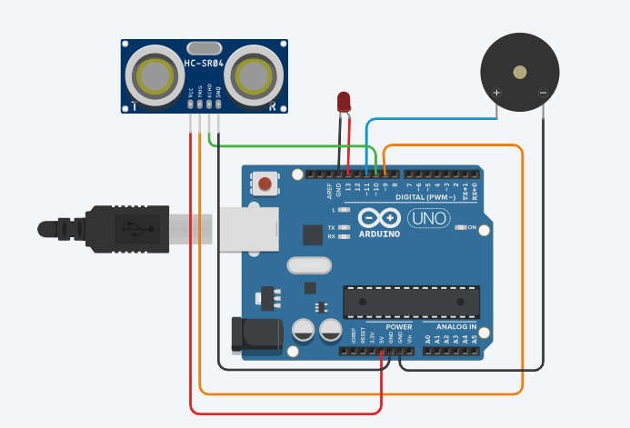

# Smart Blind Stick

This project involves the development of a Smart Blind Stick using an Arduino microcontroller. The aim is to assist visually impaired individuals in navigating their surroundings more safely and independently.

## Project Highlights

- **Ultrasonic Sensor**: Detects obstacles in the path of the user.
- **Buzzer**: Provides auditory alerts when an obstacle is detected.
- **LED**: Offers visual cues for the user.

## Features

- **Obstacle Detection**: The ultrasonic sensor continuously scans for obstacles and measures the distance.
- **Auditory Alerts**: When an obstacle is detected within a predefined range, the buzzer emits a sound to alert the user.
- **Visual Cues**: The LED lights up when an obstacle is detected, providing an additional layer of feedback.

## Components Used

- Arduino microcontroller
- Ultrasonic sensor (HC-SR04)
- Buzzer
- LED
- Jumper wires

## Circuit Diagram



## Code

The Arduino code for the Smart Blind Stick can be found in the `smart_blind_stick.ino` file. The code includes:

- Initializing the sensors and outputs.
- Continuously reading the distance from the ultrasonic sensor.
- Activating the buzzer and LED when an obstacle is detected.

```cpp
// Your Arduino code here
const int trigPin = 9;
const int echoPin = 10;
const int buzzer = 11;
const int ledPin = 13;
// defines variables
long duration;
int distance;
int safetyDistance;
void setup() {
pinMode(trigPin, OUTPUT); // Sets the trigPin as an Output
pinMode(echoPin, INPUT); // Sets the echoPin as an Input
pinMode(buzzer, OUTPUT);
pinMode(ledPin, OUTPUT);
Serial.begin(9600); // Starts the serial communication
}
void loop() {
// Clears the trigPin
digitalWrite(trigPin, LOW);
delayMicroseconds(2);
// Sets the trigPin on HIGH state for 10 micro seconds
digitalWrite(trigPin, HIGH);
delayMicroseconds(10);
digitalWrite(trigPin, LOW);
// Reads the echoPin, returns the sound wave travel time in microseconds
duration = pulseIn(echoPin, HIGH);
// Calculating the distance
distance= duration*0.034/2;
safetyDistance = distance;
  if (safetyDistance <= 100){
 digitalWrite(buzzer, HIGH);
 digitalWrite(ledPin, HIGH);
}
else{
 digitalWrite(buzzer, LOW);
 digitalWrite(ledPin, LOW);
}
// Prints the distance on the Serial Monitor
Serial.print("Distance: ");
Serial.println(distance);
}
